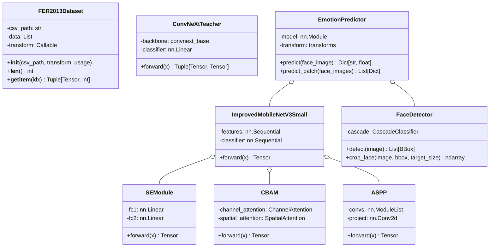

# FER System Architecture Design
# 基于深度学习的人面部表情识别系统

**版本**: v1.0
**作者**: Gao (架构师)
**日期**: 2026-05-08

---

## 1. 项目目录结构

```
fer_system/
├── docs/                          # 项目文档
│   ├── ARCHITECTURE.md            # 本架构文档
│   └── PRD.md                     # 产品需求文档
│
├── data/                          # 数据处理模块
│   ├── __init__.py
│   ├── dataset.py                 # FER2013Dataset类，数据集加载
│   └── transforms.py              # 数据增强管道，图像预处理
│
├── models/                        # 模型定义模块
│   ├── __init__.py
│   ├── attention.py               # SE、CBAM注意力模块实现
│   ├── aspp.py                    # ASPP多尺度模块实现
│   ├── student_model.py           # 改进MobileNetV3-Small学生模型
│   ├── student_model_config.py    # 学生模型配置常量
│   └── teacher_model.py           # ConvNeXt-Base教师模型封装
│
├── training/                      # 训练模块
│   ├── __init__.py
│   ├── losses.py                  # FocalLoss、KL蒸馏损失
│   ├── trainer.py                 # 标准训练循环
│   ├── distill_trainer.py         # 知识蒸馏训练循环
│   └── callbacks.py               # 训练回调（早停、模型保存等）
│
├── inference/                     # 推理模块
│   ├── __init__.py
│   ├── face_detector.py           # OpenCV人脸检测器
│   ├── predictor.py               # 表情预测推理器
│   └── postprocess.py             # 推理后处理，概率归一化等
│
├── gui/                          # GUI界面模块
│   ├── __init__.py
│   ├── main_window.py             # 主窗口，左右分栏布局
│   ├── video_thread.py            # 摄像头/视频采集QThread
│   ├── inference_thread.py        # 推理计算QThread
│   ├── widgets/                   # 自定义控件
│   │   ├── __init__.py
│   │   ├── display_widget.py      # 左侧检测画面显示widget
│   │   ├── control_panel.py       # 右侧控制面板widget
│   │   ├── emotion_bar.py         # 表情概率条形图widget
│   │   └── result_overlay.py      # 检测结果叠加widget
│   └── utils.py                   # 图像格式转换、QImage工具
│
├── utils/                        # 工具模块
│   ├── __init__.py
│   ├── config.py                  # 超参数配置管理
│   ├── logger.py                  # 日志工具
│   ├── metrics.py                 # 评估指标计算
│   └── file_utils.py              # 文件操作工具
│
├── scripts/                      # 训练/评估脚本
│   ├── __init__.py
│   ├── train_teacher.py           # 教师模型训练脚本
│   ├── train_student.py           # 学生模型蒸馏训练脚本
│   ├── evaluate.py                # 模型评估脚本
│   ├── batch_infer.py             # 批量推理脚本
│   └── export_model.py            # 模型导出/优化脚本
│
├── checkpoints/                  # 模型权重存储
│   ├── teacher/                   # 教师模型权重
│   └── student/                   # 学生模型权重
│
├── logs/                         # 训练日志
│   └── events/                    # TensorBoard事件文件
│
├── data/fer2013/                 # FER-2013数据集
│   └── fer2013.csv                # Kaggle格式数据集
│
├── requirements.txt               # Python依赖
├── README.md                      # 项目说明
├── main.py                       # GUI程序入口
├── train.py                      # 训练入口（调用train_teacher/train_student）
└── infer_cli.py                  # 命令行推理入口
```

---

## 2. 技术选型确认

### 2.1 核心框架

| 组件 | 选型 | 理由 |
|------|------|------|
| 深度学习框架 | PyTorch ≥ 1.12 | 灵活的动态图机制，便于模型调试；torchvision提供丰富预训练模型 |
| Python版本 | Python 3.8+ | 兼容性良好，支持最新语法特性 |
| GUI框架 | PyQt5 | 成熟稳定，社区资源丰富，支持复杂界面；信号槽机制天然支持多线程 |
| 图像处理 | OpenCV | 实时图像处理能力强，人脸检测集成便捷 |

### 2.2 模型选型

| 模型角色 | 选型 | 理由 |
|----------|------|------|
| 教师模型 | ConvNeXt-Base | torchvision官方预训练，ImageNet top-1 85.8%，特征表征能力强 |
| 学生模型 | MobileNetV3-Small | 参数量仅2.5M，配合注意力机制可达到轻量化与精度的平衡 |
| 注意力机制 | SE + CBAM + ASPP | SE捕获通道依赖，CBAM增强空间感知，ASPP提供多尺度上下文 |

### 2.3 人脸检测选型

| 方案 | 选型 | 理由 |
|------|------|------|
| 人脸检测器 | OpenCV Haar级联分类器 | 内置无需下载，支持多脸检测，cv2.CascadeClassifier直接使用 |
| 备选 | LBP级联分类器 | 更轻量，精度略低，适合低配设备 |

### 2.4 数据与存储

| 组件 | 选型 | 理由 |
|------|------|------|
| 数据集格式 | FER-2013 CSV (Kaggle版) | 标准基准数据集，CSV格式便于解析 |
| 历史记录 | JSON文件 | 无额外依赖，PyQt5/PyTorch兼容性好 |
| 日志 | Python logging + 文本文件 | 内置模块，无需第三方依赖 |

---

## 3. 核心数据结构

### 3.1 常量定义 (models/student_model_config.py)

```python
# 表情类别定义
EMOTION_CLASSES = ['angry', 'disgust', 'fear', 'happy', 'sad', 'surprise', 'neutral']
NUM_CLASSES = 7

# MobileNetV3-Small 通道配置
MOBILENETV3_SMALL_CHANNELS = [16, 16, 24, 40, 40, 40, 48, 48, 96, 96, 96]

# SE模块缩减比
SE_REDUCTION_RATIO = 16

# CBAM配置
CBAM_CHANNEL_REDUCTION = 16
CBAM_SPATIAL_KERNEL = 7

# ASPP配置
ASPP_DILATIONS = [1, 6, 12, 18]  # 不包含全局池化分支
ASPP_OUT_CHANNELS = 96

# 分类头配置
CLASSIFIER_HIDDEN_DIM = 256
DROPOUT_FIRST = 0.2
DROPOUT_FINAL = 0.5

# 训练超参数
DISTILL_TEMPERATURE = 4
FOCAL_LOSS_WEIGHT = 0.7
KL_LOSS_WEIGHT = 0.3
```

### 3.2 关键类签名

#### FER2013Dataset (data/dataset.py)
```python
class FER2013Dataset(Dataset):
    def __init__(self, csv_path: str, transform: Optional[Callable] = None,
                 usage: Optional[str] = None):
        """
        Args:
            csv_path: fer2013.csv文件路径
            transform: 图像变换函数
            usage: 筛选数据用途，None表示全部 ['Training', 'PublicTest', 'PrivateTest']
        """

    def __len__(self) -> int: ...
    def __getitem__(self, idx: int) -> Tuple[torch.Tensor, int]: ...
```

#### ImprovedMobileNetV3Small (models/student_model.py)
```python
class ImprovedMobileNetV3Small(nn.Module):
    def __init__(self, num_classes: int = 7, dropout: float = 0.2):
        """
        改进MobileNetV3-Small，集成SE+CBAM+ASPP注意力模块
        输出特征图尺寸: [batch, 96, 7, 7]
        """

    def forward(self, x: torch.Tensor) -> torch.Tensor:
        """
        Returns:
            logits: [batch, num_classes] 原始分类logits
        """
```

#### ConvNeXtTeacher (models/teacher_model.py)
```python
class ConvNeXtTeacher(nn.Module):
    def __init__(self, num_classes: int = 7, pretrained: bool = True):
        """
        ConvNeXt-Base教师模型，冻结前几层，微调分类头
        """

    def forward(self, x: torch.Tensor) -> Tuple[torch.Tensor, torch.Tensor]:
        """
        Returns:
            logits: [batch, num_classes]
            features: [batch, feature_dim] 中间层特征（用于蒸馏）
        """

    @classmethod
    def load_pretrained(cls, checkpoint_path: str) -> 'ConvNeXtTeacher': ...
```

#### FaceDetector (inference/face_detector.py)
```python
class FaceDetector:
    def __init__(self, scale_factor: float = 1.1, min_neighbors: int = 5,
                 min_size: Tuple[int, int] = (30, 30)):
        """
        Args:
            scale_factor: 图像缩放系数
            min_neighbors: 检测阈值
            min_size: 最小人脸尺寸
        """

    def detect(self, image: np.ndarray) -> List[Tuple[int, int, int, int]]:
        """
        检测图片中所有人脸区域
        Args:
            image: BGR格式图像 [H, W, 3]
        Returns:
            人脸区域列表 [(x, y, w, h), ...]，坐标基于原图
        """

    @staticmethod
    def crop_face(image: np.ndarray, bbox: Tuple[int, int, int, int],
                  target_size: Tuple[int, int] = (48, 48)) -> np.ndarray:
        """裁剪并缩放人脸区域到目标尺寸"""
```

#### EmotionPredictor (inference/predictor.py)
```python
class EmotionPredictor:
    def __init__(self, model_path: str, device: str = 'cpu'):
        """
        Args:
            model_path: 模型权重路径
            device: 推理设备 'cpu' 或 'cuda'
        """

    @torch.no_grad()
    def predict(self, face_image: np.ndarray) -> Dict[str, float]:
        """
        预测单个人脸的表情
        Args:
            face_image: 归一化到[0,1]的人脸图像 [48, 48, 3] 或 [48, 48]
        Returns:
            {'emotion': proba_dict} 各类别概率
        """

    @torch.no_grad()
    def predict_batch(self, face_images: List[np.ndarray]) -> List[Dict[str, float]]:
        """批量预测"""
```

#### FERSystemGUI (gui/main_window.py)
```python
class FERSystemGUI(QMainWindow):
    # ==== 信号定义 ====
    frame_ready = pyqtSignal(np.ndarray)           # 新帧准备好
    emotion_detected = pyqtSignal(dict)            # 检测结果准备好
    fps_updated = pyqtSignal(float)                 # FPS更新
    error_occurred = pyqtSignal(str)                # 错误信号

    # ==== 主要UI组件 ====
    left_widget: DisplayWidget      # 左侧：检测画面显示
    right_widget: ControlPanel      # 右侧：控制面板
    emotion_bar: EmotionBarWidget   # 表情概率条形图
    stats_label: QLabel            # 实时统计标签
```

### 3.3 Mermaid类图



---

## 4. 模型架构设计

### 4.1 改进MobileNetV3-Small完整网络结构

#### 整体架构图

```
输入图像 [Batch, 3, 48, 48]
    │
    ▼
┌─────────────────────────────────────────────────────────────────┐
│                    特征提取阶段 (Feature Extraction)              │
├─────────────────────────────────────────────────────────────────┤
│ Layer 0: Conv2d(3→16, k=3, s=2, p=1) + BN + Hardswish           │
│          输出: [B, 16, 24, 24]                                   │
│                                                                  │
│ Layer 1-2: Bneck[16→16] (SE + InvertedResidual)                 │
│          SE: C=16, r=16 → 不降维                                 │
│          输出: [B, 16, 24, 24]                                   │
│                                                                  │
│ Layer 3-4: Bneck[16→24, exp=48] (SE + InvertedResidual)         │
│          SE: C=24, r=16                                         │
│          输出: [B, 24, 12, 12]                                   │
│                                                                  │
│ Layer 5-7: Bneck[24→40, exp=240] (CBAM + InvertedResidual)      │
│          CBAM: channel_reduce=16, spatial_kernel=7              │
│          输出: [B, 40, 6, 6]                                     │
│                                                                  │
│ Layer 8-9: Bneck[40→40, exp=240] (CBAM + InvertedResidual)     │
│          输出: [B, 40, 6, 6]                                     │
│                                                                  │
│ Layer 10-11: Bneck[40→40, exp=120] (CBAM + InvertedResidual)   │
│          输出: [B, 40, 6, 6]                                     │
│                                                                  │
│ Layer 12-13: Bneck[40→48, exp=288] (CBAM + InvertedResidual)   │
│          输出: [B, 48, 3, 3]                                     │
│                                                                  │
│ Layer 14-15: Bneck[48→48, exp=288] (CBAM + InvertedResidual)   │
│          输出: [B, 48, 3, 3]                                     │
│                                                                  │
│ Layer 16-17: Bneck[48→96, exp=576] (CBAM + InvertedResidual)   │
│          输出: [B, 96, 2, 2]                                     │
│                                                                  │
│ Layer 18-19: Bneck[96→96, exp=576] (CBAM + InvertedResidual)   │
│          输出: [B, 96, 2, 2]                                     │
│                                                                  │
│ Layer 20-21: Bneck[96→96, exp=576] (CBAM + InvertedResidual)   │
│          输出: [B, 96, 2, 2]                                     │
├─────────────────────────────────────────────────────────────────┤
│                    ASPP多尺度模块                                 │
├─────────────────────────────────────────────────────────────────┤
│ 输入: [B, 96, 2, 2]                                              │
│                                                                  │
│ 分支0: Conv2d(96→32, k=1)                                       │
│ 分支1: Conv2d(96→32, k=3, d=6)   ← 空洞卷积，感受野=13          │
│ 分支2: Conv2d(96→32, k=3, d=12)  ← 空洞卷积，感受野=25          │
│ 分支3: Conv2d(96→32, k=3, d=18)  ← 空洞卷积，感受野=37          │
│ 分支4: AdaptiveAvgPool2d(1) → Conv2d(96→32)  ← 全局上下文      │
│                                                                  │
│ 拼接: [B, 160, 2, 2]                                             │
│ Project: Conv2d(160→96, k=1) + BN + Hardswish                   │
│ 输出: [B, 96, 2, 2]                                              │
├─────────────────────────────────────────────────────────────────┤
│                    轻量化分类头                                   │
├─────────────────────────────────────────────────────────────────┤
│ GlobalAveragePooling: [B, 96, 2, 2] → [B, 96]                   │
│ Dropout(0.2)                                                     │
│ Linear(96→256) + Hardswish                                       │
│ Dropout(0.5)                                                     │
│ Linear(256→7)                                                    │
│                                                                  │
输出: [B, 7] logits
└─────────────────────────────────────────────────────────────────┘
```

### 4.2 SE通道注意力模块

```python
class SEModule(nn.Module):
    """Squeeze-and-Excitation通道注意力模块"""

    def __init__(self, channels: int, reduction: int = 16):
        super().__init__()
        self.avg_pool = nn.AdaptiveAvgPool2d(1)
        self.fc = nn.Sequential(
            nn.Linear(channels, channels // reduction, bias=False),
            nn.ReLU(inplace=True),
            nn.Linear(channels // reduction, channels, bias=False),
        )

    def forward(self, x: torch.Tensor) -> torch.Tensor:
        b, c, _, _ = x.size()
        # Squeeze: 全局平均池化
        y = self.avg_pool(x).view(b, c)
        # Excitation: 通道加权
        y = self.fc(y).view(b, c, 1, 1)
        return x * y.sigmoid()
```

**计算流程**:
1. 输入 `x`: `[B, C, H, W]`
2. 全局平均池化: `y = AvgPool(x)` → `[B, C, 1, 1]` → `[B, C]`
3. 第一个FC: `y = W1 @ y + b1` → `[B, C//r]`
4. ReLU激活: `y = ReLU(y)` → `[B, C//r]`
5. 第二个FC: `y = W2 @ y + b2` → `[B, C]`
6. Sigmoid: `y = sigmoid(y)` → `[B, C]`
7. 通道加权: `output = x * y.view(B, C, 1, 1)` → `[B, C, H, W]`

### 4.3 CBAM模块

```python
class ChannelAttention(nn.Module):
    """CBAM通道注意力"""

    def __init__(self, channels: int, reduction: int = 16):
        super().__init__()
        self.avg_pool = nn.AdaptiveAvgPool2d(1)
        self.max_pool = nn.AdaptiveMaxPool2d(1)
        self.shared_mlp = nn.Sequential(
            nn.Conv2d(channels, channels // reduction, 1, bias=False),
            nn.ReLU(inplace=True),
            nn.Conv2d(channels // reduction, channels, 1, bias=False),
        )
        self.sigmoid = nn.Sigmoid()

    def forward(self, x: torch.Tensor) -> torch.Tensor:
        avg_out = self.shared_mlp(self.avg_pool(x))
        max_out = self.shared_mlp(self.max_pool(x))
        return self.sigmoid(avg_out + max_out)


class SpatialAttention(nn.Module):
    """CBAM空间注意力"""

    def __init__(self, kernel_size: int = 7):
        super().__init__()
        self.conv = nn.Conv2d(2, 1, kernel_size, padding=kernel_size // 2, bias=False)
        self.sigmoid = nn.Sigmoid()

    def forward(self, x: torch.Tensor) -> torch.Tensor:
        avg_out = torch.mean(x, dim=1, keepdim=True)
        max_out, _ = torch.max(x, dim=1, keepdim=True)
        y = torch.cat([avg_out, max_out], dim=1)
        return self.sigmoid(self.conv(y))


class CBAM(nn.Module):
    """Convolutional Block Attention Module"""

    def __init__(self, channels: int, reduction: int = 16, spatial_kernel: int = 7):
        super().__init__()
        self.channel_attention = ChannelAttention(channels, reduction)
        self.spatial_attention = SpatialAttention(spatial_kernel)

    def forward(self, x: torch.Tensor) -> torch.Tensor:
        x = x * self.channel_attention(x)
        x = x * self.spatial_attention(x)
        return x
```

**计算流程**:
1. **通道注意力**:
   - MaxPool: `[B, C, H, W]` → `[B, C, 1, 1]` → `[B, C]` → MLP → `[B, C]`
   - AvgPool: `[B, C, H, W]` → `[B, C, 1, 1]` → `[B, C]` → MLP → `[B, C]`
   - 相加 + Sigmoid: `Mc = σ(MLP(AvgPool) + MLP(MaxPool))` → `[B, C, 1, 1]`
   - 加权: `x' = x * Mc`

2. **空间注意力**:
   - 通道维度MaxPool: `[B, C, H, W]` → `[B, 1, H, W]`
   - 通道维度AvgPool: `[B, C, H, W]` → `[B, 1, H, W]`
   - 拼接: `[B, 2, H, W]`
   - 7×7Conv + Sigmoid: `Ms = σ(Conv7×7([AvgPool; MaxPool]))` → `[B, 1, H, W]`
   - 加权: `x'' = x' * Ms`

### 4.4 ASPP模块

```python
class ASPP(nn.Module):
    """Atrous Spatial Pyramid Pooling - 多尺度特征提取"""

    def __init__(self, in_channels: int, out_channels: int, dilations: List[int] = [1, 6, 12, 18]):
        super().__init__()

        self.convs = nn.ModuleList()
        for dilation in dilations:
            self.convs.append(
                nn.Sequential(
                    nn.Conv2d(in_channels, out_channels // 4, 1, bias=False),
                    nn.BatchNorm2d(out_channels // 4),
                    nn.ReLU(inplace=True),
                    nn.Conv2d(out_channels // 4, out_channels // 4, 3,
                             padding=dilation, dilation=dilation, bias=False),
                    nn.BatchNorm2d(out_channels // 4),
                    nn.ReLU(inplace=True),
                )
            )

        # 全局上下文分支
        self.global_pool = nn.Sequential(
            nn.AdaptiveAvgPool2d(1),
            nn.Conv2d(in_channels, out_channels // 4, 1, bias=False),
            nn.BatchNorm2d(out_channels // 4),
            nn.ReLU(inplace=True),
        )

        # 投影层
        self.project = nn.Sequential(
            nn.Conv2d(out_channels, out_channels, 1, bias=False),
            nn.BatchNorm2d(out_channels),
            nn.ReLU(inplace=True),
            nn.Dropout(0.5),
        )

    def forward(self, x: torch.Tensor) -> torch.Tensor:
        size = x.size()[2:]
        features = []

        for conv in self.convs:
            features.append(conv(x))

        # 全局池化分支需要上采样到原始尺寸
        global_feat = self.global_pool(x)
        global_feat = F.interpolate(global_feat, size=size, mode='bilinear', align_corners=False)
        features.append(global_feat)

        # 拼接所有分支
        x = torch.cat(features, dim=1)
        return self.project(x)
```

**分支详情** (输入96通道，输出96通道):

| 分支 | 操作 | 膨胀率 | 感受野 | 输出通道 |
|------|------|--------|--------|----------|
| 0 | Conv1×1 | 1 | 3×3 | 24 |
| 1 | Conv3×3 (dilated) | 6 | 13×13 | 24 |
| 2 | Conv3×3 (dilated) | 12 | 25×25 | 24 |
| 3 | Conv3×3 (dilated) | 18 | 37×37 | 24 |
| 4 | Global AvgPool → Conv1×1 → Upsample | - | 全图 | 24 |
| **拼接后** | Conv1×1 | - | - | **96** |

### 4.5 轻量化分类头

```python
class LightweightClassifier(nn.Module):
    """轻量化分类头，避免过多参数"""

    def __init__(self, in_channels: int, hidden_dim: int = 256, num_classes: int = 7,
                 dropout_first: float = 0.2, dropout_final: float = 0.5):
        super().__init__()
        self.head = nn.Sequential(
            nn.AdaptiveAvgPool2d(1),
            nn.Flatten(),
            nn.Dropout(dropout_first),
            nn.Linear(in_channels, hidden_dim),
            nn.Hardswish(inplace=True),
            nn.Dropout(dropout_final),
            nn.Linear(hidden_dim, num_classes),
        )

    def forward(self, x: torch.Tensor) -> torch.Tensor:
        return self.head(x)
```

---

## 5. 训练流程设计

### 5.1 两阶段训练策略

```
┌─────────────────────────────────────────────────────────────────┐
│                        阶段1: 教师模型训练                        │
├─────────────────────────────────────────────────────────────────┤
│                                                                  │
│  ┌──────────────┐     ┌──────────────┐     ┌──────────────┐     │
│  │  FER-2013    │────▶│ ConvNeXt-    │────▶│   验证集     │     │
│  │  Training    │     │    Base      │     │  准确率评估  │     │
│  │   (~28K)     │     │  (冻结backbone│     │              │     │
│  └──────────────┘     │  微调分类头) │     └──────────────┘     │
│                       └──────────────┘            │             │
│                              │                     │             │
│                              ▼                     ▼             │
│                       ┌──────────────┐     ┌──────────────┐     │
│                       │  最佳权重    │◀────│   早停检查    │     │
│                       │ teacher_best │     │  patience=10  │     │
│                       │   .pth       │     └──────────────┘     │
│                       └──────────────┘                          │
└─────────────────────────────────────────────────────────────────┘
                              │
                              │ 教师模型准备完毕
                              ▼
┌─────────────────────────────────────────────────────────────────┐
│                        阶段2: 学生模型蒸馏                         │
├─────────────────────────────────────────────────────────────────┤
│                                                                  │
│  ┌──────────────┐     ┌──────────────┐     ┌──────────────┐     │
│  │  FER-2013    │────▶│   学生模型    │     │   混合损失   │     │
│  │  Training    │     │ (MobileNetV3 │     │ Focal+KL     │     │
│  │   (~28K)     │     │  +注意力)    │     │              │     │
│  └──────────────┘     └──────┬───────┘     └──────┬───────┘     │
│                              │                     │             │
│                              │                     ▼             │
│                       ┌──────┴───────┐     ┌──────────────┐     │
│                       │  教师模型    │     │  损失反向    │     │
│                       │ (冻结，不更新)│◀────│    传播      │     │
│                       └──────────────┘     └──────────────┘     │
│                                                    │             │
│                              ┌─────────────────────┘             │
│                              ▼                                   │
│                       ┌──────────────┐     ┌──────────────┐     │
│                       │  学生最佳权重│◀────│   早停检查    │     │
│                       │ student_best │     │  patience=15  │     │
│                       │    .pth       │     └──────────────┘     │
│                       └──────────────┘                          │
└─────────────────────────────────────────────────────────────────┘
```

### 5.2 损失函数实现

#### Focal Loss
```python
class FocalLoss(nn.Module):
    """Focal Loss处理类别不平衡"""

    def __init__(self, alpha: Optional[torch.Tensor] = None,
                 gamma: float = 2.0, reduction: str = 'mean'):
        super().__init__()
        self.alpha = alpha      # 类别权重 [7]
        self.gamma = gamma       # 聚焦参数
        self.reduction = reduction

    def forward(self, inputs: torch.Tensor, targets: torch.Tensor) -> torch.Tensor:
        ce_loss = F.cross_entropy(inputs, targets, reduction='none', weight=self.alpha)
        pt = torch.exp(-ce_loss)
        focal_loss = ((1 - pt) ** self.gamma) * ce_loss

        if self.reduction == 'mean':
            return focal_loss.mean()
        elif self.reduction == 'sum':
            return focal_loss.sum()
        return focal_loss
```

#### KL蒸馏损失
```python
class DistillationLoss(nn.Module):
    """知识蒸馏KL散度损失"""

    def __init__(self, temperature: float = 4.0):
        super().__init__()
        self.temperature = temperature

    def forward(self, student_logits: torch.Tensor,
                teacher_logits: torch.Tensor) -> torch.Tensor:
        # 软化概率分布
        soft_student = F.log_softmax(student_logits / self.temperature, dim=-1)
        soft_teacher = F.softmax(teacher_logits / self.temperature, dim=-1)

        # KL散度 × T²（补偿温度缩放）
        kl_loss = F.kl_div(soft_student, soft_teacher, reduction='batchmean')
        return kl_loss * (self.temperature ** 2)
```

#### 混合损失
```python
class CombinedLoss(nn.Module):
    """混合损失: Focal Loss + KL蒸馏损失"""

    def __init__(self, focal_weight: float = 0.7, kl_weight: float = 0.3,
                 temperature: float = 4.0, alpha: Optional[torch.Tensor] = None,
                 gamma: float = 2.0):
        super().__init__()
        self.focal_loss = FocalLoss(alpha=alpha, gamma=gamma)
        self.kl_loss = DistillationLoss(temperature=temperature)
        self.focal_weight = focal_weight
        self.kl_weight = kl_weight

    def forward(self, student_logits: torch.Tensor,
                teacher_logits: torch.Tensor,
                targets: torch.Tensor) -> Tuple[torch.Tensor, Dict[str, float]]:
        focal = self.focal_loss(student_logits, targets)
        kl = self.kl_loss(student_logits, teacher_logits)

        total_loss = self.focal_weight * focal + self.kl_weight * kl

        loss_info = {
            'focal_loss': focal.item(),
            'kl_loss': kl.item(),
            'total_loss': total_loss.item()
        }
        return total_loss, loss_info
```

### 5.3 知识蒸馏实现细节

```python
# training/distill_trainer.py

class DistillationTrainer:
    def __init__(self, student: nn.Module, teacher: nn.Module,
                 criterion: CombinedLoss, optimizer: torch.optim.Optimizer,
                 device: str, scheduler: Optional[Any] = None):
        self.student = student
        self.teacher = teacher
        self.criterion = criterion
        self.optimizer = optimizer
        self.device = device
        self.scheduler = scheduler

        # 冻结教师模型
        for param in self.teacher.parameters():
            param.requires_grad = False
        self.teacher.eval()

    def train_epoch(self, train_loader: DataLoader) -> Dict[str, float]:
        self.student.train()
        total_loss = 0
        total_focal = 0
        total_kl = 0
        correct = 0
        total = 0

        for batch_idx, (images, labels) in enumerate(train_loader):
            images = images.to(self.device)
            labels = labels.to(self.device)

            # 前向传播
            student_logits = self.student(images)

            with torch.no_grad():
                teacher_logits = self.teacher(images)

            # 计算混合损失
            loss, loss_info = self.criterion(student_logits, teacher_logits, labels)

            # 反向传播
            self.optimizer.zero_grad()
            loss.backward()

            # 梯度裁剪防止爆炸
            torch.nn.utils.clip_grad_norm_(self.student.parameters(), max_norm=5.0)

            self.optimizer.step()

            # 统计
            total_loss += loss_info['total_loss']
            total_focal += loss_info['focal_loss']
            total_kl += loss_info['kl_loss']

            _, predicted = student_logits.max(1)
            total += labels.size(0)
            correct += predicted.eq(labels).sum().item()

        return {
            'loss': total_loss / len(train_loader),
            'focal': total_focal / len(train_loader),
            'kl': total_kl / len(train_loader),
            'acc': 100. * correct / total,
        }

    def validate(self, val_loader: DataLoader) -> Dict[str, float]:
        self.student.eval()
        total_loss = 0
        correct = 0
        total = 0

        with torch.no_grad():
            for images, labels in val_loader:
                images = images.to(self.device)
                labels = labels.to(self.device)

                student_logits = self.student(images)
                teacher_logits = self.teacher(images)

                loss, _ = self.criterion(student_logits, teacher_logits, labels)
                total_loss += loss.item()

                _, predicted = student_logits.max(1)
                total += labels.size(0)
                correct += predicted.eq(labels).sum().item()

        return {
            'val_loss': total_loss / len(val_loader),
            'val_acc': 100. * correct / total,
        }
```

---

## 6. 推理流程设计

### 6.1 完整推理流程

```
┌─────────────────────────────────────────────────────────────────────────┐
│                           推理流程 (单帧)                                  │
└─────────────────────────────────────────────────────────────────────────┘

                              ┌──────────────┐
                              │   输入图像   │
                              │  [H, W, 3]   │
                              └──────┬───────┘
                                     │
                                     ▼
                         ┌───────────────────────┐
                         │    人脸检测            │
                         │ FaceDetector.detect()  │
                         │ 使用Haar级联分类器      │
                         └───────────┬───────────┘
                                     │
                    ┌────────────────┼────────────────┐
                    │                │                │
                    ▼                ▼                ▼
            ┌──────────────┐ ┌──────────────┐ ┌──────────────┐
            │   人脸区域1  │ │   人脸区域2  │ │   人脸区域N  │
            │   (x,y,w,h) │ │   (x,y,w,h) │ │   (x,y,w,h)  │
            └──────┬───────┘ └──────┬───────┘ └──────┬───────┘
                   │               │               │
                   ▼               ▼               ▼
           ┌──────────────┐ ┌──────────────┐ ┌──────────────┐
           │  人脸裁剪    │ │  人脸裁剪    │ │  人脸裁剪    │
           │ crop_face() │ │ crop_face() │ │ crop_face() │
           │ → 48×48×3   │ │ → 48×48×3   │ │ → 48×48×3   │
           └──────┬───────┘ └──────┬───────┘ └──────┬───────┘
                  │               │               │
                  ▼               ▼               ▼
          ┌────────────────────────────────────────────────┐
          │              图像预处理                          │
          │  1. BGR→RGB                                     │
          │  2. 归一化 [0, 255] → [-1, 1] (mean=0.5,std=0.5)│
          │  3. HWC→CHW                                    │
          │  4. +batch维度 → [1, 3, 48, 48]                 │
          │  5. 转为torch.Tensor                           │
          └────────────────────┬───────────────────────────┘
                               │
                               ▼
                    ┌──────────────────────┐
                    │     模型推理          │
                    │  EmotionPredictor     │
                    │  .predict()           │
                    │                      │
                    │  with torch.no_grad() │
                    └──────────┬─────────────┘
                               │
                               ▼
                    ┌──────────────────────┐
                    │   输出logits [1, 7]   │
                    │ Softmax → 概率分布    │
                    └──────────┬─────────────┘
                               │
           ┌───────────────────┼───────────────────┐
           │                   │                   │
           ▼                   ▼                   ▼
    ┌─────────────┐     ┌─────────────┐     ┌─────────────┐
    │  人脸1标签  │     │  人脸2标签  │     │  人脸N标签  │
    │  anger:0.1  │     │  happy:0.8  │     │  neutral:0.6│
    │  happy:0.7  │     │  neutral:0.1│     │  sad:0.2   │
    │  ...        │     │  ...        │     │  ...        │
    └─────────────┘     └─────────────┘     └─────────────┘
           │                   │                   │
           └───────────────────┼───────────────────┘
                               │
                               ▼
                    ┌──────────────────────┐
                    │     结果聚合          │
                    │  合并多脸检测结果      │
                    │  统计各类别出现次数    │
                    └──────────────────────┘
```

### 6.2 人脸检测实现

```python
# inference/face_detector.py

class FaceDetector:
    # OpenCV内置Haar级联分类器路径
    HAAR_CASCADE_PATH = cv2.data.haarcascades + 'haarcascade_frontalface_default.xml'

    def __init__(self, scale_factor: float = 1.1, min_neighbors: int = 5,
                 min_size: Tuple[int, int] = (30, 30)):
        self.scale_factor = scale_factor
        self.min_neighbors = min_neighbors
        self.min_size = min_size
        self.cascade = cv2.CascadeClassifier(self.HAAR_CASCADE_PATH)

    def detect(self, image: np.ndarray) -> List[Tuple[int, int, int, int]]:
        """
        检测图片中所有人脸
        Returns: [(x, y, w, h), ...] 坐标基于原图
        """
        gray = cv2.cvtColor(image, cv2.COLOR_BGR2GRAY)
        faces = self.cascade.detectMultiScale(
            gray,
            scaleFactor=self.scale_factor,
            minNeighbors=self.min_neighbors,
            minSize=self.min_size,
        )
        return [tuple(f) for f in faces]

    @staticmethod
    def crop_face(image: np.ndarray, bbox: Tuple[int, int, int, int],
                  target_size: Tuple[int, int] = (48, 48),
                  expand_ratio: float = 0.1) -> Optional[np.ndarray]:
        """
        裁剪并预处理人脸区域
        Args:
            expand_ratio: 扩展人脸区域比例，避免裁剪过紧
        """
        x, y, w, h = bbox

        # 扩展区域
        expand_w = int(w * expand_ratio)
        expand_h = int(h * expand_ratio)
        x1 = max(0, x - expand_w)
        y1 = max(0, y - expand_h)
        x2 = min(image.shape[1], x + w + expand_w)
        y2 = min(image.shape[0], y + h + expand_h)

        # 裁剪
        face = image[y1:y2, x1:x2]

        # 调整尺寸
        face = cv2.resize(face, target_size, interpolation=cv2.INTER_AREA)

        return face
```

### 6.3 推理器实现

```python
# inference/predictor.py

class EmotionPredictor:
    # 表情类别名称
    EMOTION_LABELS = ['angry', 'disgust', 'fear', 'happy', 'sad', 'surprise', 'neutral']

    def __init__(self, model_path: str, device: str = 'cpu'):
        self.device = torch.device(device)

        # 加载模型
        self.model = ImprovedMobileNetV3Small(num_classes=7)
        state_dict = torch.load(model_path, map_location=self.device)
        self.model.load_state_dict(state_dict)
        self.model.to(self.device)
        self.model.eval()

        # 预处理变换
        self.transform = transforms.Compose([
            transforms.ToTensor(),  # [0,255]→[0,1]
            transforms.Normalize(mean=[0.5, 0.5, 0.5], std=[0.5, 0.5, 0.5])
        ])

    @torch.no_grad()
    def predict(self, face_image: np.ndarray) -> Dict[str, float]:
        """
        预测单个人脸表情
        Args:
            face_image: RGB格式 [H, W, 3]，像素范围 [0, 255]
        Returns:
            {emotion: probability}
        """
        # 预处理
        tensor = self.transform(face_image).unsqueeze(0).to(self.device)

        # 推理
        logits = self.model(tensor)

        # Softmax概率
        probs = F.softmax(logits, dim=-1)[0].cpu().numpy()

        return {label: float(prob) for label, prob in zip(self.EMOTION_LABELS, probs)}

    @torch.no_grad()
    def predict_topk(self, face_image: np.ndarray, k: int = 3) -> List[Tuple[str, float]]:
        """返回Top-K预测"""
        probs = self.predict(face_image)
        sorted_probs = sorted(probs.items(), key=lambda x: x[1], reverse=True)
        return sorted_probs[:k]
```

---

## 7. GUI架构设计

### 7.1 主窗口布局

```
┌────────────────────────────────────────────────────────────────────────┐
│  FER System - Facial Expression Recognition          [_][□][×]        │
├────────────────────────────────────────────────────────────────────────┤
│                                                                        │
│  ┌─────────────────────────────────┐ ┌──────────────────────────────┐ │
│  │                                 │ │  [控制面板]                    │ │
│  │                                 │ │                               │ │
│  │        左侧: 检测画面显示        │ │  [摄像头]  [导入图片]          │ │
│  │                                 │ │  [导入视频]                    │ │
│  │     DisplayWidget (QLabel)     │ │                               │ │
│  │                                 │ │  ─────────────────────        │ │
│  │     实时渲染检测框和标签        │ │  检测结果:                     │ │
│  │                                 │ │  ┌──────────────────────┐     │ │
│  │                                 │ │  │ happy     ████████ 82%│     │ │
│  │                                 │ │  │ neutral   █████    12%│     │ │
│  │                                 │ │  │ sad       ██       4%│     │ │
│  │                                 │ │  │ angry     █        2%│     │ │
│  │                                 │ │  └──────────────────────┘     │ │
│  │                                 │ │                               │ │
│  │                                 │ │  ─────────────────────        │ │
│  │                                 │ │  实时统计:                     │ │
│  │                                 │ │  当前帧: happy (1)             │ │
│  │                                 │ │  happy: 234 | sad: 45         │ │
│  │                                 │ │                               │ │
│  │                                 │ │  FPS: 28.5 | 延迟: 5ms        │ │
│  │                                 │ │                               │ │
│  │                                 │ │  ─────────────────────        │ │
│  │                                 │ │  [开始检测]  [暂停]            │ │
│  │                                 │ │  [保存记录]  [清空]           │ │
│  └─────────────────────────────────┘ └──────────────────────────────┘ │
│                                                                        │
├────────────────────────────────────────────────────────────────────────┤
│  状态栏: 就绪 | 模型: student_best.pth | 设备: CPU                     │
└────────────────────────────────────────────────────────────────────────┘
```

### 7.2 多线程设计

```python
# gui/main_window.py

class FERSystemGUI(QMainWindow):
    # === 信号定义 ===
    frame_ready = pyqtSignal(np.ndarray)           # 采集线程→主线程：新帧
    emotion_detected = pyqtSignal(list)            # 推理线程→主线程：检测结果
    fps_updated = pyqtSignal(float)                # FPS更新
    error_occurred = pyqtSignal(str)               # 错误信号
    statistics_updated = pyqtSignal(dict)          # 统计更新

    def __init__(self):
        super().__init__()
        self.video_thread = None    # 视频采集线程
        self.inference_thread = None # 推理线程
        self.predictor = None       # 推理器
        self.face_detector = None   # 人脸检测器

    @Slot()
    def start_camera(self):
        """启动摄像头模式"""
        self.video_thread = VideoThread()
        self.video_thread.frame_ready.connect(self.on_frame_ready)
        self.video_thread.start()

        # 同时启动推理线程
        self.inference_thread = InferenceThread(self.predictor, self.face_detector)
        self.inference_thread.emotion_detected.connect(self.on_emotion_detected)
        self.inference_thread.start()

    @Slot(np.ndarray)
    def on_frame_ready(self, frame: np.ndarray):
        """处理新帧：发送到推理线程并显示"""
        self.display_widget.update_frame(frame)
        self.inference_thread.add_frame(frame)

    @Slot(list)
    def on_emotion_detected(self, results: list):
        """处理检测结果"""
        # 更新显示画面（叠加标签）
        self.display_widget.draw_results(results)

        # 更新统计
        self.update_statistics(results)

        # 更新FPS
        self.fps_label.setText(f"FPS: {self.inference_thread.fps:.1f}")


# gui/video_thread.py

class VideoThread(QThread):
    """摄像头/视频采集线程"""

    frame_ready = pyqtSignal(np.ndarray)

    def __init__(self, source: Union[int, str] = 0):
        super().__init__()
        self.source = source
        self.running = True
        self.cap = None

    def run(self):
        self.cap = cv2.VideoCapture(self.source)

        while self.running:
            ret, frame = self.cap.read()
            if not ret:
                break

            # 发送帧到主线程
            self.frame_ready.emit(frame)

            # 控制帧率（目标30FPS）
            self.msleep(33)

        self.cap.release()

    def stop(self):
        self.running = False


# gui/inference_thread.py

class InferenceThread(QThread):
    """推理计算线程"""

    emotion_detected = pyqtSignal(list)
    fps_updated = pyqtSignal(float)

    def __init__(self, predictor, face_detector):
        super().__init__()
        self.predictor = predictor
        self.face_detector = face_detector
        self.frame_queue = Queue(maxsize=1)
        self.running = True
        self.frame_times = []
        self.fps = 0

    def add_frame(self, frame: np.ndarray):
        """从主线程添加待处理帧"""
        if not self.frame_queue.full():
            self.frame_queue.put(frame)

    def run(self):
        while self.running:
            if not self.frame_queue.empty():
                frame = self.frame_queue.get()

                start_time = time.time()

                # 1. 人脸检测
                faces = self.face_detector.detect(frame)

                results = []
                for bbox in faces:
                    # 2. 裁剪人脸
                    face = self.face_detector.crop_face(frame, bbox)

                    # 3. 表情预测
                    emotions = self.predictor.predict(face)

                    # 4. 保存结果
                    x, y, w, h = bbox
                    results.append({
                        'bbox': (x, y, w, h),
                        'emotions': emotions,
                        'top_emotion': max(emotions, key=emotions.get)
                    })

                # 计算FPS
                elapsed = time.time() - start_time
                self.fps = 1.0 / elapsed if elapsed > 0 else 0

                self.emotion_detected.emit(results)

        QThread.msleep(1)

    def stop(self):
        self.running = False
```

### 7.3 信号槽连接图

```
┌─────────────────────────────────────────────────────────────────────────┐
│                           信号槽连接                                    │
├─────────────────────────────────────────────────────────────────────────┤
│                                                                         │
│  VideoThread                      FERSystemGUI                          │
│  ┌──────────────┐                ┌──────────────────────────────┐     │
│  │ frame_ready │ ──────────────▶│ on_frame_ready(frame)         │     │
│  └──────────────┘                │   ├─ DisplayWidget.update()   │     │
│                                   │   └─ InferenceThread.add()    │     │
│                                   └──────────────────────────────┘     │
│                                                                         │
│  InferenceThread                    FERSystemGUI                       │
│  ┌──────────────┐                ┌──────────────────────────────┐     │
│  │emotion_detect│ ──────────────▶│ on_emotion_detected(results) │     │
│  └──────────────┘                │   ├─ DisplayWidget.draw()     │     │
│                                   │   ├─ update_statistics()     │     │
│                                   │   └─ fps_label.setText()     │     │
│                                   └──────────────────────────────┘     │
│                                                                         │
│  ControlPanel                     FERSystemGUI                          │
│  ┌──────────────┐                ┌──────────────────────────────┐     │
│  │start_clicked│ ──────────────▶│ start_camera()                │     │
│  │stop_clicked │ ──────────────▶│ stop_camera()                 │     │
│  │image_load   │ ──────────────▶│ load_image()                  │     │
│  │video_load   │ ──────────────▶│ load_video()                  │     │
│  └──────────────┘                └──────────────────────────────┘     │
│                                                                         │
└─────────────────────────────────────────────────────────────────────────┘
```

---

## 8. 有序任务列表

### 阶段1: 项目基础与数据处理 (T01-T03)

| 任务ID | 任务标题 | 涉及文件 | 依赖 | 实现要点 |
|--------|----------|----------|------|----------|
| T01 | 项目基础配置 | `utils/config.py`, `utils/logger.py`, `utils/__init__.py`, `requirements.txt` | - | 1. 定义EMOTION_CLASSES、NUM_CLASSES常量<br>2. 创建训练超参数类（学习率、批次大小等）<br>3. 配置logging格式和文件输出<br>4. 编写requirements.txt依赖 |
| T02 | 数据集加载与预处理 | `data/dataset.py`, `data/transforms.py`, `data/__init__.py` | T01 | 1. 实现FER2013Dataset读取CSV格式<br>2. 支持usage列筛选（Training/PublicTest/PrivateTest）<br>3. 实现数据增强：随机翻转、旋转、亮度对比度调整<br>4. 图像归一化到[-1,1]<br>5. 实现collate_fn支持批次加载 |
| T03 | FER2013数据下载脚本 | `scripts/download_data.py` | T01 | 1. 创建数据集下载脚本<br>2. 支持从Kaggle下载或本地指定路径<br>3. 验证数据完整性 |

### 阶段2: 模型定义 (T04-T07)

| 任务ID | 任务标题 | 涉及文件 | 依赖 | 实现要点 |
|--------|----------|----------|------|----------|
| T04 | 注意力模块实现 | `models/attention.py`, `models/__init__.py` | T01 | 1. 实现SEModule：全局池化→FC(C,C//16)→ReLU→FC(C//16,C)→Sigmoid<br>2. 实现ChannelAttention：MaxPool+AvgPool→共享MLP→相加→Sigmoid<br>3. 实现SpatialAttention：通道维度MaxPool+AvgPool→7×7Conv→Sigmoid<br>4. 实现CBAM：串联通道注意力和空间注意力<br>5. 导出EModule、CBAM类 |
| T05 | ASPP模块实现 | `models/aspp.py`, `models/__init__.py` | T01 | 1. 实现4个并行分支：1×1Conv + 3个空洞卷积(dilation=6,12,18)<br>2. 实现全局平均池化分支用于捕获全局上下文<br>3. 拼接所有分支输出<br>4. 1×1Conv投影降维到原始通道数<br>5. 导出ASPP类 |
| T06 | 学生模型实现 | `models/student_model.py`, `models/student_model_config.py`, `models/__init__.py` | T04, T05 | 1. 基于MobileNetV3-Small修改<br>2. 在指定层插入SE模块（Layer1-4）<br>3. 在Layer5-11插入CBAM模块<br>4. 在最后插入ASPP模块<br>5. 实现轻量化分类头：GAP→Dropout(0.2)→Linear→Hardswish→Dropout(0.5)→Linear(7)<br>6. 确保参数量≤5M |
| T07 | 教师模型封装 | `models/teacher_model.py`, `models/__init__.py` | T01 | 1. 使用torchvision.models.convnext_base(pretrained=True)<br>2. 修改分类头为Linear(1024, 7)<br>3. 实现forward返回logits和中间特征<br>4. 支持加载预训练checkpoint<br>5. 导出ConvNeXtTeacher类 |

### 阶段3: 训练模块 (T08-T10)

| 任务ID | 任务标题 | 涉及文件 | 依赖 | 实现要点 |
|--------|----------|----------|------|----------|
| T08 | 损失函数实现 | `training/losses.py`, `training/__init__.py` | T01 | 1. 实现FocalLoss：支持alpha类别权重和gamma聚焦参数<br>2. 实现DistillationLoss：KL散度，温度T=4<br>3. 实现CombinedLoss：0.7×Focal + 0.3×KL<br>4. 返回total_loss和详细loss_info字典 |
| T09 | 标准训练循环 | `training/trainer.py`, `training/callbacks.py`, `training/__init__.py` | T02, T07, T08 | 1. 实现Trainer类：训练/验证循环<br>2. 实现EarlyStopping回调（patience=10）<br>3. 实现ModelCheckpoint保存最佳模型<br>4. 支持学习率调度（ReduceLROnPlateau）<br>5. 日志记录训练指标到TensorBoard和文件 |
| T10 | 蒸馏训练循环 | `training/distill_trainer.py`, `training/__init__.py` | T06, T07, T08 | 1. 实现DistillationTrainer类<br>2. 教师模型冻结（requires_grad=False）<br>3. 学生模型接收软标签监督<br>4. EarlyStopping（patience=15）<br>5. 记录蒸馏损失各项分解指标 |

### 阶段4: 推理模块 (T11-T13)

| 任务ID | 任务标题 | 涉及文件 | 依赖 | 实现要点 |
|--------|----------|----------|------|----------|
| T11 | 人脸检测器实现 | `inference/face_detector.py`, `inference/__init__.py` | T01 | 1. 使用cv2.CascadeClassifier加载Haar级联<br>2. 实现detect()检测所有人脸<br>3. 实现crop_face()裁剪并resize到48×48<br>4. 支持expand_ratio扩展检测区域<br>5. 返回人脸区域列表[(x,y,w,h),...] |
| T12 | 表情预测器实现 | `inference/predictor.py`, `inference/postprocess.py`, `inference/__init__.py` | T06, T11 | 1. 加载学生模型权重，eval()模式<br>2. 实现predict()单脸预测，返回{emotion: prob}<br>3. 实现predict_batch()批量预测<br>4. 实现predict_topk()返回Top-K预测<br>5. 推理时使用torch.no_grad()减少内存 |
| T13 | 推理优化 | `scripts/export_model.py` | T12 | 1. 使用torch.jit.trace模型加速<br>2. 模型量化（可选，int8）<br>3. 验证推理延迟≤6ms（CPU） |

### 阶段5: GUI界面 (T14-T17)

| 任务ID | 任务标题 | 涉及文件 | 依赖 | 实现要点 |
|--------|----------|----------|------|----------|
| T14 | 主窗口实现 | `gui/main_window.py`, `gui/__init__.py` | T11, T12 | 1. QMainWindow主窗口，PyQt5<br>2. 左右分栏布局（QHBoxLayout）<br>3. 定义信号：frame_ready、emotion_detected、fps_updated<br>4. 实现slot函数处理各信号<br>5. 状态栏显示模型路径和设备 |
| T15 | 视频采集线程 | `gui/video_thread.py`, `gui/inference_thread.py`, `gui/utils.py`, `gui/__init__.py` | T14 | 1. VideoThread继承QThread，cv2.VideoCapture采集<br>2. frame_ready信号传递帧到主线程<br>3. InferenceThread独立推理线程<br>4. frame_queue队列解耦采集和推理<br>5. 计算并发布FPS |
| T16 | 显示控件实现 | `gui/widgets/display_widget.py`, `gui/widgets/emotion_bar.py`, `gui/widgets/__init__.py` | T14 | 1. DisplayWidget显示检测画面<br>2. draw_results()在画面上绘制人脸框和标签<br>3. EmotionBarWidget显示7类表情概率条形图<br>4. 实时更新UI不阻塞主线程 |
| T17 | 控制面板实现 | `gui/widgets/control_panel.py`, `gui/widgets/result_overlay.py`, `gui/widgets/__init__.py` | T14, T15 | 1. 按钮：启动摄像头、导入图片、导入视频<br>2. 实时统计当前帧各类别出现次数<br>3. 显示FPS和推理延迟<br>4. 保存历史记录到JSON<br>5. 清空统计按钮 |

### 阶段6: 训练脚本 (T18-T20)

| 任务ID | 任务标题 | 涉及文件 | 依赖 | 实现要点 |
|--------|----------|----------|------|----------|
| T18 | 教师模型训练脚本 | `scripts/train_teacher.py` | T09, T02 | 1. argparse解析参数（epochs、lr、batch_size等）<br>2. 加载FER2013数据集<br>3. 初始化ConvNeXt-Base教师模型<br>4. 调用Trainer训练<br>5. 保存最佳权重到checkpoints/teacher/ |
| T19 | 学生模型蒸馏脚本 | `scripts/train_student.py` | T10, T02 | 1. 加载预训练教师模型<br>2. 初始化改进MobileNetV3-Small<br>3. 调用DistillationTrainer<br>4. 验证准确率≥74.38%<br>5. 保存最佳权重到checkpoints/student/ |
| T20 | 模型评估脚本 | `scripts/evaluate.py` | T12, T02 | 1. 在PrivateTest上评估模型<br>2. 计算混淆矩阵<br>3. 输出每类Precision/Recall/F1<br>4. 计算整体Accuracy<br>5. 保存评估报告到JSON |

### 阶段7: 程序入口与文档 (T21-T23)

| 任务ID | 任务标题 | 涉及文件 | 依赖 | 实现要点 |
|--------|----------|----------|------|----------|
| T21 | GUI入口程序 | `main.py` | T14-T17 | 1. QApplication初始化<br>2. 加载默认模型权重<br>3. 创建并显示主窗口<br>4. 处理退出清理 |
| T22 | 批量推理脚本 | `scripts/batch_infer.py` | T12 | 1. 支持批量处理图片目录<br>2. 输出检测结果到CSV<br>3. 并行处理加速 |
| T23 | README文档 | `README.md` | T21, T22 | 1. 项目介绍<br>2. 环境安装说明<br>3. 使用方法<br>4. 技术架构概述 |

---

## 9. 依赖包列表 (requirements.txt)

```
# === 核心框架 ===
torch>=1.12.0
torchvision>=0.13.0

# === GUI框架 ===
PyQt5>=5.15.0

# === 数据处理 ===
numpy>=1.21.0
Pillow>=9.0.0
opencv-python>=4.5.0

# === 训练相关 ===
tensorboard>=2.10.0
tqdm>=4.64.0

# === 工具 ===
scikit-learn>=1.1.0    # 评估指标计算
matplotlib>=3.5.0      # 可视化
```

**最小依赖版本说明**:
- `torch>=1.12.0`: 支持torch.compile等新特性
- `torchvision>=0.13.0`: 提供ConvNeXt预训练模型
- `PyQt5>=5.15.0`: 稳定版本，支持Python 3.8+
- `opencv-python>=4.5.0`: 包含DNN模块和Haar级联分类器

---

## 10. 跨文件共享约定

### 10.1 命名规范

| 类型 | 规范 | 示例 |
|------|------|------|
| 模块名 | snake_case | `face_detector.py` |
| 类名 | PascalCase | `FaceDetector` |
| 函数名 | snake_case | `crop_face()` |
| 常量 | UPPER_SNAKE_CASE | `NUM_CLASSES` |
| 私有成员 | 前缀 `_` | `_cascade` |
| 内部变量 | snake_case | `frame_queue` |

### 10.2 常量定义位置

```python
# models/student_model_config.py - 模型相关常量
NUM_CLASSES = 7
EMOTION_LABELS = ['angry', 'disgust', 'fear', 'happy', 'sad', 'surprise', 'neutral']
SE_REDUCTION_RATIO = 16
ASPP_DILATIONS = [1, 6, 12, 18]

# inference/predictor.py - 推理相关常量
IMAGE_SIZE = (48, 48)
NORMALIZE_MEAN = [0.5, 0.5, 0.5]
NORMALIZE_STD = [0.5, 0.5, 0.5]

# training/losses.py - 损失函数相关常量
DISTILL_TEMPERATURE = 4.0
FOCAL_LOSS_WEIGHT = 0.7
KL_LOSS_WEIGHT = 0.3

# utils/config.py - 训练超参数
class TrainConfig:
    TEACHER_EPOCHS = 50
    STUDENT_EPOCHS = 100
    TEACHER_LR = 1e-4
    STUDENT_LR = 3e-4
    BATCH_SIZE = 64
```

### 10.3 接口协议

#### 预测器接口
```python
# 所有预测器必须实现此接口
class BasePredictor(ABC):
    @abstractmethod
    def predict(self, face_image: np.ndarray) -> Dict[str, float]:
        """预测单个人脸，返回 {emotion: probability}"""
        pass

    @abstractmethod
    def predict_batch(self, face_images: List[np.ndarray]) -> List[Dict[str, float]]:
        """批量预测"""
        pass
```

#### 损失函数接口
```python
# 所有损失函数必须实现此接口
class BaseLoss(ABC):
    @abstractmethod
    def forward(self, *args, **kwargs) -> Tuple[torch.Tensor, Dict[str, float]]:
        """返回 (loss, loss_info)"""
        pass
```

#### 数据集接口
```python
# 所有数据集必须实现此接口
class BaseDataset(Dataset):
    @abstractmethod
    def __len__(self) -> int:
        pass

    @abstractmethod
    def __getitem__(self, idx: int) -> Tuple[torch.Tensor, int]:
        """返回 (image_tensor, label)"""
        pass
```

### 10.4 路径约定

```python
# 所有路径相对于项目根目录
ROOT_DIR = Path(__file__).parent
DATA_DIR = ROOT_DIR / 'data' / 'fer2013'
CHECKPOINT_DIR = ROOT_DIR / 'checkpoints'
LOG_DIR = ROOT_DIR / 'logs'
```

### 10.5 设备管理

```python
# utils/config.py
def get_device(prefer_cuda: bool = True) -> torch.device:
    """统一设备管理"""
    if prefer_cuda and torch.cuda.is_available():
        return torch.device('cuda')
    return torch.device('cpu')
```

### 10.6 错误处理

```python
# 统一异常定义
class FERSystemError(Exception):
    """FER系统基础异常"""
    pass

class ModelLoadError(FERSystemError):
    """模型加载失败"""
    pass

class FaceDetectionError(FERSystemError):
    """人脸检测失败"""
    pass

class DataLoadError(FERSystemError):
    """数据加载失败"""
    pass
```

---

## 附录A: 技术指标对照表

| 指标 | 目标值 | 验证方法 |
|------|--------|----------|
| 学生模型参数量 | ≤ 5M | `model.parameters() | sum(p.numel())` |
| 测试集准确率 | ≥ 74.38% | PrivateTest评估 |
| 单帧CPU延迟 | ≤ 6ms | `time.time()`计时 |
| 实时帧率 | ≥ 25 FPS | 1s/平均帧间隔 |
| 人脸检测率 | - | FER-2013正面人脸为主 |

---

## 附录B: FER-2013数据集格式

```
fer2013.csv 结构:
Usage,emotion,pixels
Training,0,"70 80 82 72 58 ..."   # 2304个像素值(48x48)
PublicTest,2,"52 59 77 79 66 ..."  # emotion: 0-6
PrivateTest,4,"41 58 71 63 58 ..."  # 7个表情类别

emotion映射:
0 - angry
1 - disgust
2 - fear
3 - happy
4 - sad
5 - surprise
6 - neutral
```

---

**文档版本**: v1.0
**创建日期**: 2026-05-08
**作者**: Gao (架构师)
